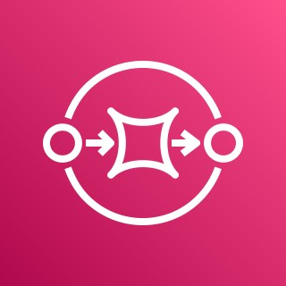

<h2>Hey 👋, I'm Adrian Sudbury!</h2>

<h3>Get In Touch at <a href="mailto:sudburya@gmail.com">sudburya@gmail.com</a></h3>

<table cellspacing="5" cellpadding="5" width="100%">
  <tr>
    <td colspan='4'></td>
  </tr>
  <tr>
    <td colspan='4'><h3 style="vertical-align:middle">I'm currently working on AWS with the following</h3></td>
  </tr>
  <tr> 
    <td align="center"> NodeJS</td>
    <td align="center"> TypeScript</td>
    <td align="center"> React</td>
    <td align="center"> Pulumi</td>
  </tr>
  <tr>
    <td align="center"> Serverless</td>
    <td align="center"> VPC</td>
    <td align="center"> API Gateway</td>
    <td align="center"> Lambda</td>
  </tr>
  <tr>
    <td align="center"> Aurora RDS</td>
    <td align="center"> SQS</td>
    <td align="center"> S3 Bucket</td>
   <td align="center"> CloudFront</td>
  </tr>
</table>

 

<table align="left" cellspacing="0" cellpadding="0" width="100%">
  <tr>
    <td> </td>
    <td></td>
  </tr>
</table>

| Description                                                              | Repository                                                                | Website                                                                           |
| ------------------------------------------------------------------------ | ------------------------------------------------------------------------- | --------------------------------------------------------------------------------- |
|  Showcase                        | [repository](https://github.com/asudbury/showcase)                        | https://asudbury.github.io/showcase                                               |
|  SpaceX Launches                 | [repository](https://github.com/asudbury/spacex-launches)                 | https://asudbury.github.io/spacex-launches                                        |
|  Azure Static Web App            | [repository](https://github.com/asudbury/azure-static-web-app)            | https://nice-plant-05bbd1103.azurestaticapps.net/                                 |
|  React Admin Simple              | [repository](https://github.com/asudbury/react-admin-simple)              | https://asudbury.github.io/react-admin-simple                                     |
|  React Admin Tutorial            | [repository](https://github.com/asudbury/react-admin-tutorial)            | https://asudbury.github.io/react-admin-tutorial                                   |
|  React Admin CRM                 | [repository](https://github.com/asudbury/react-admin-crm)                 | https://asudbury.github.io/react-admin-crm                                        |
|  React Admin Demo                | [repository](https://github.com/asudbury/react-admin-demo)                | https://asudbury.github.io/react-admin-demo                                       |
|  React Material Dashboard        | [repository](https://github.com/asudbury/react-material-dashboard)        | https://asudbury.github.io/react-material-dashboard                               |
|  React Netflix Clone             | [repository](https://github.com/asudbury/react-netflix-clone)             | https://asudbury.github.io/react-netflix-clone                                    |
|  React Facebook Clone            | [repository](https://github.com/asudbury/react-facebook-clone)            | https://asudbury.github.io/react-facebook-clone                                   |
|  React Spotify Clone             | [repository](https://github.com/asudbury/react-spotify-clone)             | https://asudbury.github.io/react-spotify-clone                                    |
|  React Twitter Clone             | [repository](https://github.com/asudbury/react-twitter-clone)             | https://asudbury.github.io/react-twitter-clone                                    |
|  React Gmail Clone               | [repository](https://github.com/asudbury/react-gmail-clone)               | https://asudbury.github.io/react-gmail-clone                                      |
|  React JIRA Clone                | [repository](https://github.com/asudbury/react-jira-clone)                | [https://asudbury.github.io/asudbury/react-jira-clone](http://jira.ivorreic.com/) |
|  React AirBnb Clone              | [repository](https://github.com/asudbury/react-airbnb-clone)              | https://asudbury.github.io/react-airbnb-clone                                     |
|  React YouTube Clone             | [repository](https://github.com/asudbury/react-youtube-clone)             | https://asudbury.github.io/react-youtube-clone                                    |
|  React Spreadsheet               | [repository](https://github.com/asudbury/react-spreadsheet)               | https://asudbury.github.io/react-spreadsheet                                      |
|  React Syntax Highlighter        | [repository](https://github.com/asudbury/react-syntax-highlighter)        | https://asudbury.github.io/react-syntax-highlighter                               |
|  Json Rule Editor                | [repository](https://github.com/asudbury/json-rule-editor)                | https://asudbury.github.io/json-rule-editor                                       |
|  Json Rule Editor Help           | [repository](https://github.com/asudbury/json-rule-editor-docs)           | https://asudbury.github.io/json-rule-editor-docs                                  |
|  React Redux Real World          | [repository](https://github.com/asudbury/react-redux-realworld)           | https://asudbury.github.io/react-redux-realworld                                  |
|  React Material Dashboard Devias | [repository](https://github.com/asudbury/react-material-dashboard-devias) | https://asudbury.github.io/react-material-dashboard-devias                        |
|  React Material Kit              | [repository](https://github.com/asudbury/react-material-kit)              | https://asudbury.github.io/react-material-kit                                     |
|  React Material Chartist         | [repository](https://github.com/asudbury/react-material-chartist)         | https://asudbury.github.io/react-material-chartist                                |
|  React Material World            | [repository](https://github.com/asudbury/material-ui-world)               | https://asudbury.github.io/material-ui-world                                      |
|  React Material Berry Dashboard  | [repository](https://github.com/asudbury/react-material-berry-dashboard)  | https://asudbury.github.io/react-material-berry-dashboard                         |
|  Angular Material Dashboard      | [repository](https://github.com/asudbury/angular-material-dashboard)      | https://asudbury.github.io/angular-material-dashboard                             |
|  Space Invaders                  | [repository](https://github.com/asudbury/space_invaders)                  | https://asudbury.github.io/space_invaders                                         |
|  Material UI Theme Switcher      | [repository](https://github.com/asudbury/material-ui-theme-switcher)      | https://asudbury.github.io/material-ui-theme-switcher                             |
|  Material UI Theme Creator       | [repository](https://github.com/asudbury/mui-theme-creator)               | https://asudbury.github.io/mui-theme-creator                                      |
|  React Open Weather              | [repository](https://github.com/asudbury/react-open-weather)              | https://asudbury.github.io/react-open-weather                                     |
|  React Hello World               | [repository](https://github.com/asudbury/react-hello-world)               | https://asudbury.github.io/react-hello-world                                      |
|  React Calculator                | [repository](https://github.com/asudbury/react-calculator)                | https://asudbury.github.io/react-calculator                                       |
|  React Redux Todo                | [repository](https://github.com/asudbury/react-redux-todo)                | https://asudbury.github.io/react-redux-todo                                       |
|  React Redux Toolkit Todo        | [repository](https://github.com/asudbury/react-redux-toolkit-todo)        | https://asudbury.github.io/react-redux-toolkit-todo                               |
|  Azure Function Greeting         | [repository](https://github.com/asudbury/Azure-Greeting)                  | https://azure-greeting.azurewebsites.net/api/Greeting?name=JohnDoe                |
|  Azure Function City Lookup      | [repository](https://github.com/asudbury/Azure-City-Lookup)               | http://azure-cities-lookup.azurewebsites.net/api/lookup?q=Nottingham              |
|  Fireworks                       | [repository](https://github.com/asudbury/fireworks)                       | https://asudbury.github.io/fireworks                                              |
